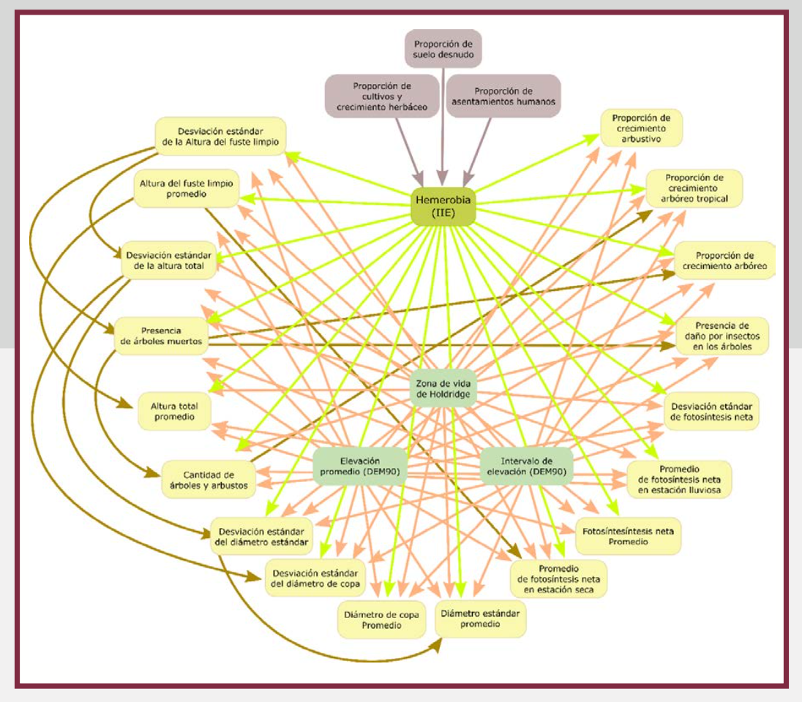

<a name="ie-model"></a>

<br />

<h3 align="center">

# Integridad Ecológica

</h3>

<!-- ABOUT THE PROJECT -->

El objetivo de este proyecto es estimar un índice de integridad ecológica (IE) mediante un modelo de red bayesiana. La IE es la capacidad del ecosistema para mantener un sistema ecológico integrado, balanceado y adaptable, que tenga el rango completo de elementos y procesos que se esperarían en el área natural de la región.

<p align="right">

(<a href="#readme-top">back to top</a>)

</p>

<!-- GETTING STARTED -->

## Modelo

Se desarrolló una red bayesiana con las siguientes capas:

-   Detección de signos: Observaciones obtenidas de sensores remotos.

-   Contextual: Representa las condiciones fisicoquímicas dentro de las cuales, las variables de la capa de detección de signos varían.

-   Latente: Define la condición de la integridad ecológica basándose en los valores de la capa de detección de signos y contextual.

-   Intervención humana: Condiciones que podrían afectar la integridad ecológica.



## Datos

Se utilizó como proxy para la integridad ecológica, la hemerobia.


| Variable                                           | Capa                | Fuente                                       |
|----------------------------------------------------|---------------------|----------------------------------------------|
| Hemerobia                                          | Latente             | Uso de suelo y vegetación, INEGI             |
| Proporción de cultivos y crecimiento herbáceo      | Intervención humana | MAD-Mex                                      |
| Proporción de asentamientos humanos                | Intervención humana | MAD-Mex                                      |
| Proporción de suelo desnudo                        | Intervención humana | MAD-Mex                                      |
| Zona de vida de Holdridge                          | Contextual          | Portal de Geoinformación, CONABIO            |
| Elevación promedio (DEM90)                         | Contextual          | Continuo de Elevaciones Mexicano, INEGI      |
| Mínimo de elevación                                | Contextual          | Continuo de Elevaciones Mexicano, INEGI      |
| Máximo de elevación                                | Contextual          | Continuo de Elevaciones Mexicano, INEGI      |
| Fotosíntesis neta promedio                         | Detección de signos | MODIS/Terra Gross Primary Productivity, NASA |
| Desviación estándar de fotosíntesis neta           | Detección de signos | MODIS/Terra Gross Primary Productivity, NASA |
| Promedio de fotosístesis neta en estación lluviosa | Detección de signos | MODIS/Terra Gross Primary Productivity, NASA |
| Promedio de fotosítesis neta en estación seca      | Detección de signos | MODIS/Terra Gross Primary Productivity, NASA |
| Proporción de crecimiento arbustivo                | Detección de signos | MAD-Mex                                      |
| Proporsión de crecimiento arbóreo tropical         | Detección de signos | MAD-Mex                                      |
| Proporción de crecimiento arbóreo                  | Detección de signos | MAD-Mex                                      |
| VH                                                 | Detección de signos | Sentinel-1 SAR GRD, Copernicus               |
| VH entropía                                        | Detección de signos | Sentinel-1 SAR GRD, Copernicus               |

Variables

This is an example of how to list things you need to use the software and how to install them. \* npm `sh   npm install npm@latest -g`

### Implementación

1.  Get a free API Key at <https://example.com>

2.  Clone the repo

    ``` sh
    git clone https://github.com/github_username/repo_name.git
    ```

3.  Install NPM packages

    ``` sh
    npm install
    ```

4.  Enter your API in `config.js`

    ``` js
    const API_KEY = 'ENTER YOUR API';
    ```

<p align="right">

(<a href="#readme-top">back to top</a>)

</p>

<!-- USAGE EXAMPLES -->

## Usage

Use this space to show useful examples of how a project can be used. Additional screenshots, code examples and demos work well in this space. You may also link to more resources.

*For more examples, please refer to the [Documentation](https://example.com)*

<p align="right">

(<a href="#readme-top">back to top</a>)

</p>

<!-- ROADMAP -->

## Roadmap

-   [ ] Feature 1
-   [ ] Feature 2
-   [ ] Feature 3
    -   [ ] Nested Feature

See the [open issues](https://github.com/github_username/repo_name/issues) for a full list of proposed features (and known issues).

<p align="right">

(<a href="#readme-top">back to top</a>)

</p>

<!-- CONTRIBUTING -->

## Contributing

Contributions are what make the open source community such an amazing place to learn, inspire, and create. Any contributions you make are **greatly appreciated**.

If you have a suggestion that would make this better, please fork the repo and create a pull request. You can also simply open an issue with the tag "enhancement". Don't forget to give the project a star! Thanks again!

1.  Fork the Project
2.  Create your Feature Branch (`git checkout -b feature/AmazingFeature`)
3.  Commit your Changes (`git commit -m 'Add some AmazingFeature'`)
4.  Push to the Branch (`git push origin feature/AmazingFeature`)
5.  Open a Pull Request

<p align="right">

(<a href="#readme-top">back to top</a>)

</p>

<!-- LICENSE -->

## License

Distributed under the MIT License. See `LICENSE.txt` for more information.

<p align="right">

(<a href="#readme-top">back to top</a>)

</p>

<!-- CONTACT -->

## Contact

Your Name - [\@twitter_handle](https://twitter.com/twitter_handle) - [email\@email](mailto:email@email){.email}\_client.com

Project Link: <https://github.com/github_username/repo_name>

<p align="right">

(<a href="#readme-top">back to top</a>)

</p>

<!-- ACKNOWLEDGMENTS -->

## Acknowledgments

-   

-   

-   

<p align="right">

(<a href="#readme-top">back to top</a>)

</p>

<!-- MARKDOWN LINKS & IMAGES -->

<!-- https://www.markdownguide.org/basic-syntax/#reference-style-links -->
