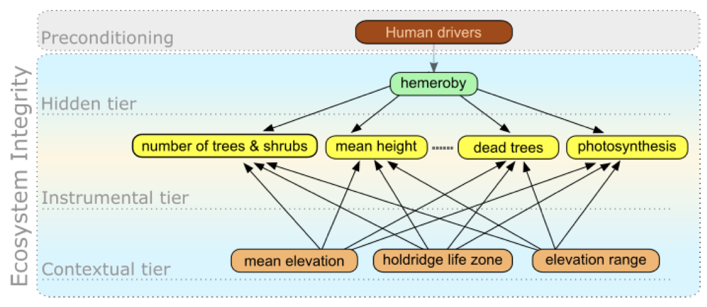
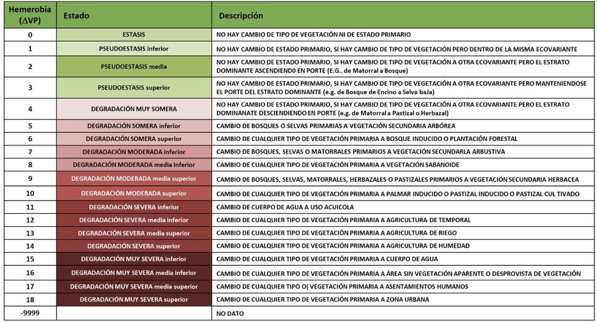

 

<h3 align="center">

# Integridad Ecológica

</h3>

<!-- ABOUT THE PROJECT -->

El objetivo de este proyecto es estimar un índice de integridad ecológica (IE) mediante un modelo de red bayesiana. La IE es la capacidad del ecosistema para mantener un sistema ecológico integrado, balanceado y adaptable, que tenga el rango completo de elementos y procesos que se esperarían en el área natural de la región.

<!-- GETTING STARTED -->

## Modelo

Se desarrolló una red bayesiana con las siguientes capas:

-   Detección de signos: Observaciones obtenidas de sensores remotos.

-   Contextual: Representa las condiciones fisicoquímicas dentro de las cuales, las variables de la capa de detección de signos varían.

-   Latente: Define la condición de la integridad ecológica basándose en los valores de la capa de detección de signos y contextual.

-   Intervención humana: Condiciones provocadas por el ser humano, que podrían afectar la integridad ecológica.

## Datos

| Variable                                           | Capa                | Fuente                                       |
|----------------------------|-------------------|--------------------------|
| Hemerobia                                          | Latente             | Uso de suelo y vegetación, INEGI             |
| Proporción de cultivos y crecimiento herbáceo      | Intervención humana | MAD-Mex                                      |
| Proporción de asentamientos humanos                | Intervención humana | MAD-Mex                                      |
| Proporción de suelo desnudo                        | Intervención humana | MAD-Mex                                      |
| Zona de vida de Holdridge                          | Contextual          | Portal de Geoinformación, CONABIO            |
| Elevación promedio (DEM90)                         | Contextual          | Continuo de Elevaciones Mexicano, INEGI      |
| Mínimo de elevación                                | Contextual          | Continuo de Elevaciones Mexicano, INEGI      |
| Máximo de elevación                                | Contextual          | Continuo de Elevaciones Mexicano, INEGI      |
| Fotosíntesis neta promedio                         | Detección de signos | MODIS/Terra Gross Primary Productivity, NASA |
| Desviación estándar de fotosíntesis neta           | Detección de signos | MODIS/Terra Gross Primary Productivity, NASA |
| Promedio de fotosístesis neta en estación lluviosa | Detección de signos | MODIS/Terra Gross Primary Productivity, NASA |
| Promedio de fotosítesis neta en estación seca      | Detección de signos | MODIS/Terra Gross Primary Productivity, NASA |
| Proporción de crecimiento arbustivo                | Detección de signos | MAD-Mex                                      |
| Proporsión de crecimiento arbóreo tropical         | Detección de signos | MAD-Mex                                      |
| Proporción de crecimiento arbóreo                  | Detección de signos | MAD-Mex                                      |
| VH                                                 | Detección de signos | Sentinel-1 SAR GRD, Copernicus               |
| VH entropía                                        | Detección de signos | Sentinel-1 SAR GRD, Copernicus               |

Para entrenar la capa latente, se utilizó la hemerobia como proxy de integridad ecológica. Ésta estima el grado de transformación que mostró la vegetación primaria, respecto a la cobertura terrestre actual.

## Implementación

Se utilizó la paquetería `bnlearn`. Se entrenó la red con datos del 2017, a una resolución de 250m para todo el territorio Mexicano.

La red es un modelo de clasificación (ya que la hemerobia es una variable categórica). El modelo arroja la probabilidad de que cada pixel pertenezca a una de las 18 categorías de la hemerobia. El índice de IE se estimó mediante la esperanza, la cual fue estandarizada, resultando en un índice del 0 (degradado) al 1 (bien conservado).

Se puede estimar el índice de IE para todo año en el que se tengan datos, con la red entrenada para 2017.

## Workflow

1.  Proyectar cada raster a la misma medida (extent), sistema de coordenadas (epsg) y resolución, mediante los scripts de la carpeta `scripts/source_extraction`.
2.  Crear una matriz de adyacencia. El script `1. initialize_adj_matrix.R`, recibe el directorio de la carpeta en donde se encuetran los rasters y crea una matriz cuyos nombres de cada renglón y columna corresponden al nombre de cada uno. Una vez creada, ésta puede ser manipulada en otro software, como Excel. Deber ser llenada con 1's donde existe un arco entre las variables. La dirección del arco es renglón ---\> columna.
3.  Para entrenar el modelo se tiene que transformar los rasters a un dataframe mediante el script `2. create_dataframe` , el cual recibe el directorio de la carpeta en donde se encuetran los rasters y arroja un dataframe con cada columna con los valores de cada raster.
4.  El `script 3. fit_model` recibe el dataframe y la matriz de adyacencia para entrenar la red bayesiana, guardando la red ya entrenada y el raster con el índice de IE.
5.  Con el script `4. predict_with_bn` se puede predecir el índice de IE con la red entrenada en el paso anterior y con nuevos datos.
