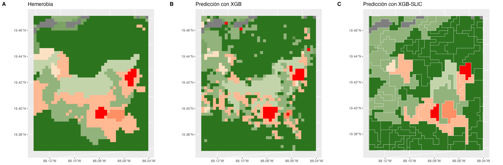

# Integridad Ecológica

El objetivo es estimar la integridad ecológica (IE) en todo el territorio 
Mexicano. Esta se define como la capacidad del ecosistema para mantener un 
sistema ecológico integrado, balanceado y adaptable, que tenga el rango completo 
de elementos y procesos que se esperarían en el área natural de la región.

## Datos

La integridad ecológica no puede ser directamente observada, por lo que se 
utilizó la hemerobia como *proxy*, asumiendo que puede ser considerada como una 
medición de la integridad. Ésta representa el grado de transformación que mostró 
la vegetación primaria respecto a la cobertura terrestre actual, siendo una 
variable categórica ordinal, donde 0 es el estado intacto y 18 el de mayor 
degradación.

Para modelar la hemerobia se tomaron en cuenta variables relacionadas a la 
integridad ecológica. Se incluyeron las zonas de vida de Holdridge y la 
elevación, con el fin de considerar la variabilidad natural de las condiciones 
bioclimáticas que definen los distintos tipos de ecosistemas. La condición de la 
vegetación se describió mediante datos de fotosíntesis y en una primera versión 
del modelo, a través de datos obtenidos del INFyS (Inventario Nacional Forestal 
y de Suelos), que publicaba observaciones obtenidas de muestreo en campo. Sin 
embargo, esta última fuente ha sido descontinuada, por lo que fue sustituida con 
datos de radar, los cuales han sido previamente utilizados para modelar vegetación, 
por ejemplo, para predicción de la altura del dosel. También se consideró el uso 
de suelo, que identifica distintos tipos relacionados a cierta integridad 
ecológica, como cultivos y asentamientos urbanos. La fuente de datos de uso de 
suelo para la primera versión del modelo, fue MAD-Mex, sin embargo, sólo se tienen 
datos hasta 2018, por lo que se sustituyó por MODIS Land Cover. Por último, se 
probó agregar al modelo la variable distancia al borde del parche, que 
representó la fragmentación.

El ráster de cada una de las variables fue transformado a una misma resolución 
de 250m x 250m.

| Fuente de datos                             | Definición                                                                                                                     | Variables                                    | Resolución de origen (m)           | Transformación a resolución de 250m | Fuente                                         |
|---------------------------------------------|--------------------------------------------------------------------------------------------------------------------------------|----------------------------------------------|------------------------------------|-------------------------------------|------------------------------------------------|
| Hemerobia                                   | Grado de transformación que mostró la vegetación primaria respecto a la cobertura terrestre actual                             | Hemerobia                                    | 250                                | \-                                  | Uso de suelo y vegetación, INEGI               |
| Zona de vida de Holdridge                   | Agrupa en 28 zonas basándose en precipitación, biotemperatura y la evapotranspiración                                          | Zona de vida de Holdridge                    | 260                                | Interpolación con Nearest Neighbor  | Portal de Geoinformación, CONABIO              |
| Elevación (DEM)                             | Altura sobre nivel promedio del mar                                                                                            | Promedio                                     | 30                                 | Promedio                            | DEM GLO-30, Copernicus                         |
|                                             |                                                                                                                                | Mínimo                                       |                                    | Mínimo                              |                                                |
|                                             |                                                                                                                                | Máximo                                       |                                    | Máximo                              |                                                |
| Fotosíntesis (Productividad primaria bruta) | Cantidad total de compuestos de carbono producidos por la fotosíntesis                                                         | Promedio anual                               | 500                                | Interpolación con Nearest Neighbor  | Terra Gross Primary Productivity, NASA LP DAAC |
|                                             |                                                                                                                                | DE anual                                     |                                    |                                     |                                                |
|                                             |                                                                                                                                | Promedio en estación de lluvias              |                                    |                                     |                                                |
|                                             |                                                                                                                                | Promedio en estación seca                    |                                    |                                     |                                                |
| Radar (de apertura sintética en la banda C) | Coeficiente de retrodispersión que depende de la geometría del terreno y sus características electromagnéticas                 | Promedio anual de banda VH y VV              | 40                                 | Promedio                            | Sentinel-1, Copernicus Sentinel data           |
|                                             |                                                                                                                                | DE anual de banda VH y VV                    |                                    |                                     |                                                |
|                                             |                                                                                                                                | Entropía del promedio anual de banda VV y VH |                                    |                                     |                                                |
| Uso de suelo (MODIS Land Cover)             | Estimación basada en imágenes satelitales del tipo de uso de suelo, que incluye cultivos, asentamientos urbanos, bosques, etc. | Uso de suelo                                 | 500                                | Interpolación con Nearest Neighbor  | MODIS Land Cover Type, NASA LP DAAC            |
| Distancia al borde                          | Distancia, en metros, de cada pixel al borde del parche                                                                        | Distancia al borde                           | 250                                | \-                                  |                                                |
| Fuentes descontinuadas                      |                                                                                                                                |                                              |                                    |                                     |                                                |
| Uso de suelo (MAD-Mex)                      | Estimación basada en Landsat                                                                                                   | Proporción de cultivos y pastizales          | 30                                 | Proporción de cada categoría        | MAD-Mex, CONABIO                               |
|                                             |                                                                                                                                | Proporción de asentamientos humanos          |                                    |                                     |                                                |
|                                             |                                                                                                                                | Proporción de suelo desnudo                  |                                    |                                     |                                                |
|                                             |                                                                                                                                | Proporción de matorral                       |                                    |                                     |                                                |
|                                             |                                                                                                                                | Proporción de selva                          |                                    |                                     |                                                |
|                                             |                                                                                                                                | Proporción de bosque                         |                                    |                                     |                                                |
| INFyS                                       | Inventario Nacional Forestal y de Suelos                                                                                       | Número de árboles y arbustos                 | Muestreo en malla de 5, 10 y 20 km | Interpolación con XGBoost           | INFyS                                          |
|                                             |                                                                                                                                | Presencia de daño por insectos en árboles    |                                    |                                     |                                                |
|                                             |                                                                                                                                | Presencia de árboles muertos                 |                                    |                                     |                                                |
|                                             |                                                                                                                                | Diámetro de tronco (promedio y DE)           |                                    |                                     |                                                |
|                                             |                                                                                                                                | Diámetro de copa (promedio y DE)             |                                    |                                     |                                                |
|                                             |                                                                                                                                | Altura total de árbol (promedio y DE)        |                                    |                                     |                                                |
|                                             |                                                                                                                                | Altura de fuste limpio (promedio y DE)       |                                    |                                     |                                                |

DE: Desviación Estándar

## Modelos

Teniendo un proxy de la variable que se quiere predecir y siendo ésta una 
variable categórica, se puede ajustar un modelo supervisado de tipo 
clasificación. En este caso, se usó una red bayesiana y XGBoost.

### Red bayesiana

Es un modelo probabilístico gráfico, donde cada nodo corresponde a una variable 
aleatoria y cada arista representa la dependencia condicional entre las 
variables que conecta. El modelo tiene 4 capas:

- Detección de signos: Observaciones obtenidas de sensores remotos.

- Contextual: Representa las condiciones fisicoquímicas dentro de las cuales, 
  las variables de la capa de detección de signos varían.

- Latente: Define la condición de la integridad ecológica basándose en los 
  valores de la capa de detección de signos y contextual.

- Intervención humana: Condiciones provocadas por el ser humano, que 
  podrían afectar la integridad ecológica.

El modelo estima la probabilidad de pertenecer a cada clase de la hemerobia para 
cada uno de los pixeles. Para estimar un índice de integridad ecológica (IIE), 
se calculó el promedio de las clases ponderado por la probabilidad de cada una 
de ellas, obteniendo un valor continuo del 0 al 18. Para obtener un índice del 
0 al 1, se dividió entre 18. Y para que el 0 represente el estado con mayor 
degradación y el 1 el estado intacto, se restó este valor a la unidad. A 
continuación se muestra un ejemplo:

| pixel | Clase 0 | Clase 1 | ... | Clase 18 | Predicción |
|-------|---------|---------|-----|----------|------------|
| x     | 0.1     | 0.1     |     | 0.7      | 0.2        |

$$
IIE=1-\frac{\sum_{k=0}^{18} kp_k}{18}=1-\frac{0(0.1)+1(0.1)+...+18(0.7)}{18}=0.2
$$

La transformación anterior se realizó con el fin de obtener un valor continuo a 
partir de un valor categórico. Este método supone que existe el mismo espacio 
entre categorías de la hemerobia, por ejemplo, pasar del estado 3 al 4, 
representa la misma degradación que pasar del 14 al 15. De ser esto correcto, 
sería más adecuado que la conversión se hiciera antes de entrenar el modelo y 
que éste fuera una regresión, ya que así el modelo tomaría en cuenta el orden de 
las categorías, lo que no ocurre con un modelo de clasificación. Otro 
inconveniente de la transformación es la pérdida de interpretabilidad, pues no 
se sabe qué categoría de la hemerobia se predice para cada pixel, esto a su vez 
representa un problema al analizar la precisión del modelo, pues la predicción 
no puede ser directamente comparada con la hemerobia.

Otra manera de asignar los valores del mapa con el modelo de clasificación, es 
tomar la clase que tiene mayor probabilidad, como en el ejemplo de la siguiente 
tabla. De esta forma la precisión del modelo puede ser evaluada, comparando la 
predicción con la verdadera categoría (hemerobia).

| Pixel | Clase 0 | Clase 1 | ... | Clase 18 | Predicción |
|-------|---------|---------|-----|----------|------------|
| x     | 0.1     | 0.1     |     | 0.7      | 18         |

La estructura del grafo de la red bayesiana debe ser definida previamente al 
entrenamiento. En este caso, se definió de manera conjunta por expertos y por un 
algoritmo que aprende la estructura a partir de los datos. En el grafo cada 
arista representa la dependencia condicional entre las variables que conecta 
(padre ---\> hijo), por lo que cada variable es independiente de las variables 
no hijas dado el valor de sus variables padres, por ejemplo, la variable 
fotosíntesis es independiente de la variable de radar VH, dado el valor de la 
hemerobia. Esto podría ser una desventaja, pues el modelo solo aprende de las 
relaciones que se definieron en el grafo, al contrario de otros modelos que 
pueden aprender cualquier patrón presente en los datos, como XGBoost.

### XGBoost

Es un modelo que combina modelos débiles, es decir modelos con baja precisión, 
comúnmente árboles de decisión, para que en conjunto se obtenga una predicción 
mucho más exacta. El entrenamiento es iterativo, agregando en cada paso un nuevo 
árbol de decisión que predice el error de los árboles anteriores. Al final, se 
combinan las predicciones de los árboles en una predicción total.

Para entrenar el modelo se tomaron de manera aleatoria el 70% de los datos, el 
30% restante se usó para su validación. Con este modelo de clasificación, al 
igual que con la red bayesiana, se obtiene la probabilidad de que cada pixel 
pertenezca a cada clase de la hemerobia, asignando la de mayor probabilidad.

### SLIC

Los mapas generados con modelos de clasificación presentan un efecto 
*sal y pimienta*, derivado de la naturaleza de estos, pues predicen el valor 
pixel por pixel. La hemerobia no tiene este efecto, ya que la integridad 
ecológica no suele cambiar de un cuadrante de 250m x 250m a otro, por el 
contrario, las regiones con una integridad similar suelen ser más extensas, 
como los son bosques, cultivos, ciudades.

Para eliminar este efecto, se usó el algoritmo SLIC, que crea agrupaciones de 
pixeles, llamadas *superpixeles,* con características similares de acuerdo a las 
variables deseadas. En este caso, se utilizaron las bandas VV y VH del radar 
Sentinel-1, así como la fotosíntesis anual media y su desviación estándar, ya 
que estas representan el estado de la vegetación.

## Resultados

En la siguiente tabla se muestra la precisión (proporción de pixeles con la 
clase de hemerobia correcta) de cada modelo probado.

|                                           | Total | Training | Testing |
|-------------------------------------------|-------|----------|---------|
| Red bayesiana\*                           | 20.2% |          |         |
| Red bayesiana\*\*                         | 48.0% |          |         |
| XGBoost\*\*\*                             | 75.1% | 77.2%    | 70.2%   |
| XGBoost con distancia al borde\*\*\*      | 75.9% | 77.9%    | 71.3%   |
| XGBoost-SLIC\*\*\*                        | 70.5% | 73.9%    | 62.5%   |
| XGBoost-SLIC con distancia al borde\*\*\* | 70.8% | 73.8%    | 63.7%   |

\* Usando INFyS en vez de radar y MAD-Mex en vez de MODIS Land Cover

\* Usando MAD-Mex en vez de MODIS Land Cover

\*\*\* Ignorando fuentes descontinuadas

Nota: Para la red bayesiana con INFyS como variables predictoras, sólo se 
contaba con los valores convertidos a IIE (0 a 1), por lo que para poder 
comparar contra la hemerobia, se estimó la clase de cada pixel revirtiendo 
la fórmula de IIE, obteniendo el promedio ponderado y asignando la clase 
resultado de redondear este valor.

$$
k=\mathrm{redondear}(-18(\mathrm{IIE}-1))
$$

Observando los mapas, las 3 predicciones son parecidas a la hemerobia. La 
integridad ecológica, estimada mediante la red bayesiana con INFyS y calculando 
el IIE, da un mapa suavizado, no hace diferencia entre ciertas zonas con 
integridad similar. El modelo XGBoost sí lo hace, sin embargo, presenta un 
efecto *sal y pimienta*. Por último, se observa que el modelo que utiliza 
*superpixeles*, es el más parecido a la hemerobia.

Si se quiere conocer los detalles de la implementación, se puede encontrar la 
documentación en la carpeta de cada modelo `scripts/bn_model` y 
`scripts/xgb_model`.
