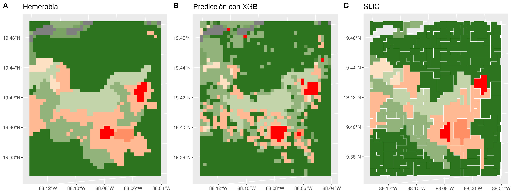

# Integridad Ecológica

El objetivo es estimar un índice de integridad ecológica (IIE) en México. La IE es la capacidad del ecosistema para mantener un sistema ecológico integrado, balanceado y adaptable, que tenga el rango completo de elementos y procesos que se esperarían en el área natural de la región.

Para modelar el IIE se utilizó la hemerobia como _proxy_, ésta representa el grado de transformación que mostró la vegetación primaria respecto a la cobertura terrestre actual, siendo una variable categórica ordinal, donde 0 es el estado intacto y 18 el de mayor degradación.

Teniendo un proxy de la variable que se quiere estimar y siendo ésta una variable categórica, se puede ajustar un modelo supervisado de tipo clasificación. Hasta el momento, se han probado 2 modelos: Red bayesiana y XGBoost, entrenados con los siguientes datos:

| Datos                                         | Fuente                                       |
|-----------------------------------------------|----------------------------------------------|
| Hemerobia                                     | Uso de suelo y vegetación, INEGI             |
| Uso de suelo                                  | MAD-Mex/MODIS land cover                     |
| Zona de vida de Holdridge                     | Portal de Geoinformación, CONABIO            |
| Elevación                                     | Copernicus DEM GLO-30                        |
| Fotosíntesis                                  | MODIS/Terra Gross Primary Productivity, NASA |
| Radar (C-band Synthetic Aperture Radar (SAR)) | Sentinel-1 SAR GRD, Copernicus               |
| Distancia al borde                            |                                              |

## Red bayesiana

Es un modelo probabilístico gráfico, donde cada nodo corresponde a una variable aleatoria y cada arista representa la dependencia condicional entre las variables que conecta. El modelo tiene 4 capas:

-   Detección de signos: Observaciones obtenidas de sensores remotos.

-   Contextual: Representa las condiciones fisicoquímicas dentro de las cuales, las variables de la capa de detección de signos varían.

-   Latente: Define la condición de la integridad ecológica basándose en los valores de la capa de detección de signos y contextual.

-   Intervención humana: Condiciones provocadas por el ser humano, que podrían afectar la integridad ecológica.

TODO: Cambiar lo explicación de ser un modelo de clasificación probabilista y tomar el valor con la probabilidad más alta y poner la explicación de como se genera el mapa de Integridad Ecológica que se les entrega. Hacer énfasis en la manera que se calculcula la "estandarización"

Para estimar el IIE, se calculó el promedio ponderado para cada pixel y se estandarizó este valor para obtener un número del 0 al 1, donde 1 es el estado intacto y 0 el de mayor degradación. Este método asume que existe el mismo espacio entre categorías de la hemerobia.

$$
\frac{18-\sum_{k=0}^{18}kp_k}{18}
$$

TODO: Comentar un poco sobre los posibles riesgos de hacer este cálculo y porque no creemos sea correcto, o qué hipótesis intervienen para que sea interpretable.

Otra manera de asignar los valores del mapa ... Al ser un modelo de clasificación, se obtiene la probabilidad de que cada pixel pertenezca a cada clase de la hemerobia y se asigna la que tiene mayor probabilidad.

| Pixel | Clase 0 | Clase 1 | ... | Clase 18 | Clase |
|-------|---------|---------|-----|----------|-------|
| 1     | 0.2     | 0.1     |     | 0.7      | 18    |
| ...   |         |         |     |          |       |
| n     | 0.01    | 0.6     |     | 0.2      | 1     |

La red bayesiana es un modelo con una estructura previamente definida (**qué implicaciones, por ejemplo sobbre la independencia de las variables**), donde las dependencias entre variables fueron determinadas de manera conjunta por expertos y por un algoritmo que aprende la estructura a partir de los datos (desconocemos a ciencia cierta como se generó la red para el modelo IIE 2018). La precisión de la predicción podría aumentar con un modelo que no tenga una estructura restringida, como lo es XGBoost.

## XGBoost

Es un modelo que combina modelos débiles, es decir modelos con baja precisión, comunmente árboles de decisión, para que en conjunto se obtenga una predicción mucho más exacta. El entrenamiento es iterativo, agregando en cada paso un nuevo árbol de decisión que predice el error de los árboles anteriores. Al final, se combinan las predicciones de todos los árboles en una predicción total.

Con este modelo de clasificación, al igual que con la red bayesiana, se obtiene la probabilidad de que cada pixel pertenezca a cada clase de la hemerobia, asignando la de mayor probabilidad.

TODO: Explicar qué posibles causas creemos que hicieron el efecto sal y pimienta o más bien como esperamos poderlo quitar. Por ejemplo comparar el proceso de SLIC con el concepto de hemerobia en el sentido de regiones homogeneas

El mapa resultante muestra un efecto "sal y pimienta", por lo que se agruparon los pixeles en "superpixeles" con el algoritmo SLIC.

## Comparación de los modelos

En la siguiente tabla se muestra la precisión (proporción de pixeles con la clase de hemerobia correcta) de cada modelo probado.

|                                     |       |          |         |
|-------------------------------------|-------|----------|---------|
|                                     | Total | Training | Testing |
| Red bayesiana con InFyS             | 20.2% |          |         |
| Red bayesiana                       | 48.0% |          |         |
| XGBoost                             | 75.1% | 77.2%    | 70.2%   |
| XGBoost-SLIC                        | 70.5% | 73.9%    | 62.5%   |
| XGBoost-SLIC con distancia al borde | 70.8% | 73.8%    | 63.7%   |

TODO: Explicar como hicimos para comparar los mapas que produce Julián con los nuestros.
TODO: Explicar que estamos entendiendo a la hemerobia como una "medición" real de la IIE