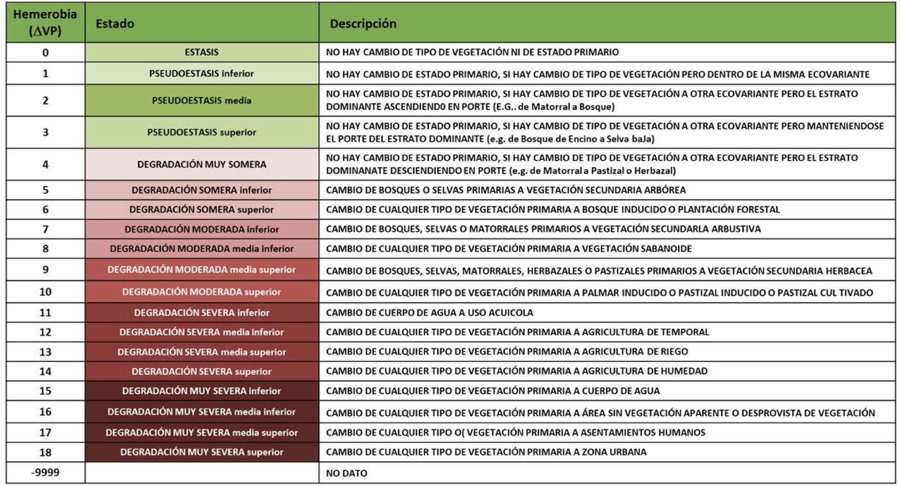
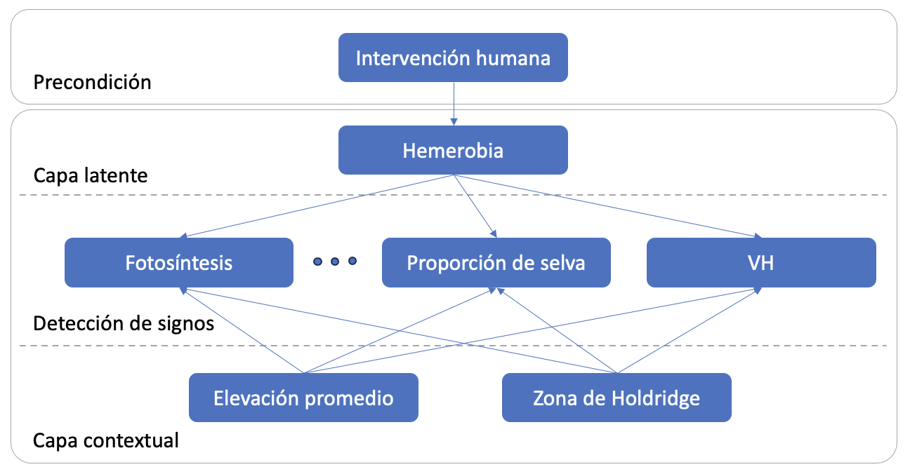
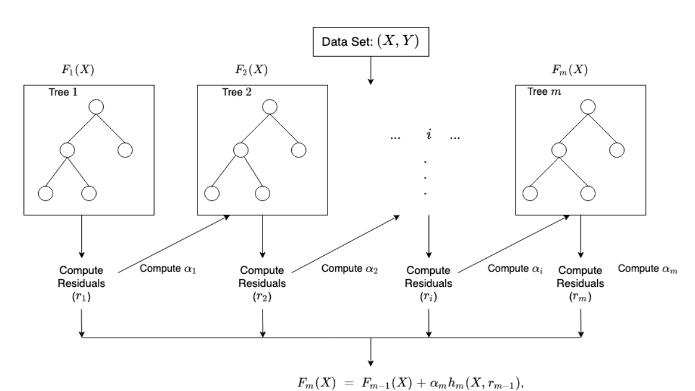
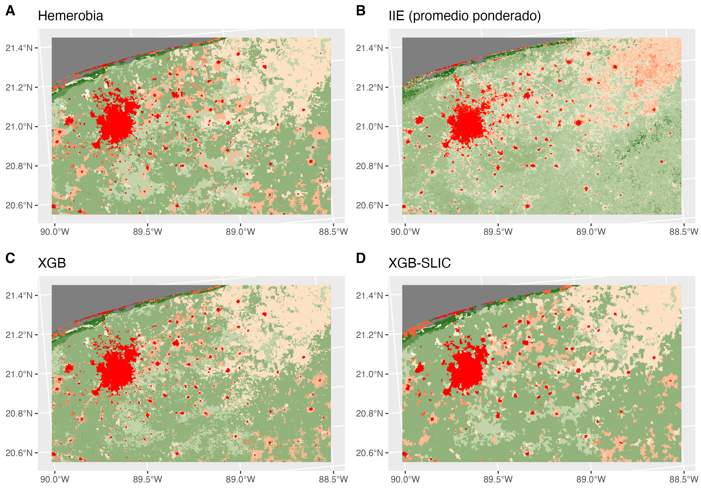

# Integridad Ecológica

El objetivo es estimar un índice de integridad ecológica (IIE) en México. La IE es la capacidad del ecosistema para mantener un sistema ecológico integrado, balanceado y adaptable, que tenga el rango completo de elementos y procesos que se esperarían en el área natural de la región.

## Datos

La integridad ecológica no puede ser directamente observada, por lo que para modelar el IIE se utilizó la hemerobia como *proxy*, asumiendo que es una medición certera de la integridad ecológica subyacente. La hemerobia representa el grado de transformación que mostró la vegetación primaria respecto a la cobertura terrestre actual, siendo una variable categórica ordinal, donde 0 es el estado intacto y 18 el de mayor degradación.

Teniendo un proxy de la variable que se quiere predecir y siendo ésta una variable categórica, se puede ajustar un modelo supervisado de tipo clasificación, tomando los siguientes datos:

| Datos                                         | Fuente                                       |
|------------------------------------|------------------------------------|
| Hemerobia                                     | Uso de suelo y vegetación, INEGI             |
| Uso de suelo                                  | MAD-Mex/MODIS land cover                     |
| Zona de vida de Holdridge                     | Portal de Geoinformación, CONABIO            |
| Elevación                                     | Copernicus DEM GLO-30                        |
| Fotosíntesis                                  | MODIS/Terra Gross Primary Productivity, NASA |
| Radar (C-band Synthetic Aperture Radar (SAR)) | Sentinel-1 SAR GRD, Copernicus               |
| Distancia al borde                            |                                              |

### Pre-procesamiento

Rejilla de 250m x 250m

## Modelos

### Red bayesiana

Es un modelo probabilístico gráfico, donde cada nodo corresponde a una variable aleatoria y cada arista representa la dependencia condicional entre las variables que conecta. El modelo tiene 4 capas:

-   Detección de signos: Observaciones obtenidas de sensores remotos.

-   Contextual: Representa las condiciones fisicoquímicas dentro de las cuales, las variables de la capa de detección de signos varían.

-   Latente: Define la condición de la integridad ecológica basándose en los valores de la capa de detección de signos y contextual.

-   Intervención humana: Condiciones provocadas por el ser humano, que podrían afectar la integridad ecológica.

TODO: Cambiar lo explicación de ser un modelo de clasificación probabilista y tomar el valor con la probabilidad más alta y poner la explicación de como se genera el mapa de Integridad Ecológica que se les entrega. Hacer énfasis en la manera que se calculcula la "estandarización"

El modelo estima la probabilidad de pertenecer a cada clase para cada uno de los pixeles. Para estimar el IIE, se calculó el promedio de las clases ponderado por la probabilidad de cada una de ellas, obteniendo un valor continuo del 0 al 18. Para obtener un índice del 0 al 1, se dividió entre 18. Y para que el 0 represente el estado con mayor degradación y el 1 el estado intacto, se restó este valor a la unidad.

| pixel | Clase 0 | Clase 1 | ... | Clase 18 | Predicción |
|-------|---------|---------|-----|----------|------------|
| x     | 0.1     | 0.1     |     | 0.7      | 0.2        |

$$
1-\frac{\sum_{k=0}^{18}kp_k}{18}=1-\frac{0(0.1)+1(0.1)+...+18(0.7)}{18}=0.2
$$

TODO: Comentar un poco sobre los posibles riesgos de hacer este cálculo y porque no creemos sea correcto, o qué hipótesis intervienen para que sea interpretable.

La transformación anterior se realizó con el fin de obtener un valor continuo a partir de un valor categórico. Este método asume que existe el mismo espacio entre categorías de la hemerobia, por ejemplo pasar del estado 3 al 4, representa la misma degradación que pasar del 14 al 15. De ser esto correcto, sería más adecuado que la conversión se hiciera antes de entrenar el modelo y que éste fuera una regresión, ya que de esta manera el modelo tomaría en cuenta el orden de las categorías, lo que no ocurre con un modelo de clasificación. Otro inconveniente de esta transformación es la pérdida de interpretabilidad, pues no se sabe que categoría de la hemerobia se predice para cada pixel, esto a su vez representa un problema al analizar la precisión del modelo, pues la predicción no pude ser directamente comparada con la hemerobia.

Otra manera de asignar los valores del mapa con el modelo de clasificación, es tomar la clase que tiene mayor probabilidad. De esta forma la precisión del modelo puede ser evaluada, comparando la predicción con la verdadera categoría (hemerobia).

| Pixel | Clase 0 | Clase 1 | ... | Clase 18 | Predicción |
|-------|---------|---------|-----|----------|------------|
| x     | 0.1     | 0.1     |     | 0.7      | 18         |

La red bayesiana es un modelo con una estructura previamente definida (**qué implicaciones, por ejemplo sobre la independencia de las variables**), donde las dependencias entre variables fueron determinadas de manera conjunta por expertos y por un algoritmo que aprende la estructura a partir de los datos (desconocemos a ciencia cierta como se generó la red para el modelo IIE 2018). La precisión de la predicción podría aumentar con un modelo que no tenga una estructura restringida, como lo es XGBoost.

### XGBoost

Es un modelo que combina modelos débiles, es decir modelos con baja precisión, comúnmente árboles de decisión, para que en conjunto se obtenga una predicción mucho más exacta. El entrenamiento es iterativo, agregando en cada paso un nuevo árbol de decisión que predice el error de los árboles anteriores. Al final, se combinan las predicciones de todos los árboles en una predicción total.

Se tomó el 70% de los datos para entrenar el modelo y 30% para su validación.

Con este modelo de clasificación, al igual que con la red bayesiana, se obtiene la probabilidad de que cada pixel pertenezca a cada clase de la hemerobia, asignando la de mayor probabilidad.

#### SLIC

TODO: Explicar qué posibles causas creemos que hicieron el efecto sal y pimienta o más bien como esperamos poderlo quitar. Por ejemplo comparar el proceso de SLIC con el concepto de hemerobia en el sentido de regiones homogeneas

El mapa generado con los modelos de clasificación, presentan un efecto *sal y pimienta*, derivado de la naturaleza del modelo, pues este predice el valor pixel por pixel. La hemerobia no tiene este efecto, ya que la integridad ecológica no suele cambiar de un cuadrante de 250m x 250m a otro, por el contrario, las regiones con una integridad similar suelen ser más extensas, como los son bosques, cultivos, ciudades.

Para eliminar este efecto, se uso el algoritmo SLIC, que crea agrupaciones de pixeles, llamadas *superpixeles,* con características similares de acuerdo a las variables deseadas. Se utilizaron las bandas VV y VH del radar Sentinel-1, así como la fotosíntesis anual media y su desviación estándar, debido a que fueron variables importantes en el modelo XGBoost, además de reflejar la condición de la vegetación, que a su vez está correlacionada con la integridad ecológica.

## Resutados

En la siguiente tabla se muestra la precisión (proporción de pixeles con la clase de hemerobia correcta) de cada modelo probado. Cabe mencionar, que para la red bayesiana con INFyS como variables predictoras, sólo se contaba con los valores convertidos a IIE (0 a 1), por lo que para poder comparar contra la hemerobia, se estimó la clase de cada pixel revirtiendo la fórmula de IIE, obteniendo el promedio ponderado y asignando la clase resultado de redondear este valor.

$$
redondear(-18(IIE-1))
$$

|                                     |       |          |         |
|-------------------------------------|-------|----------|---------|
|                                     | Total | Training | Testing |
| Red bayesiana con INFyS             | 20.2% |          |         |
| Red bayesiana                       | 48.0% |          |         |
| XGBoost                             | 75.1% | 77.2%    | 70.2%   |
| XGBoost-SLIC                        | 70.5% | 73.9%    | 62.5%   |
| XGBoost-SLIC con distancia al borde | 70.8% | 73.8%    | 63.7%   |

TODO: Explicar como hicimos para comparar los mapas que produce Julián con los nuestros. TODO: Explicar que estamos entendiendo a la hemerobia como una "medición" real de la IIE
