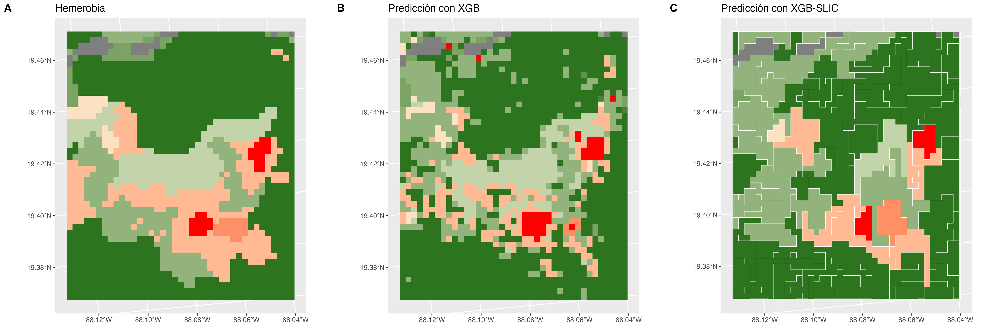

# Integridad Ecológica

El objetivo es estimar un índice de integridad ecológica (IIE) en México. La IE es la capacidad del ecosistema para mantener un sistema ecológico integrado, balanceado y adaptable, que tenga el rango completo de elementos y procesos que se esperarían en el área natural de la región.

## Datos

La integridad ecológica no puede ser directamente observada, por lo que para modelar el IIE se utilizó la hemerobia como *proxy*, asumiendo que puede ser considerada como una medición de la integridad. Ésta representa el grado de transformación que mostró la vegetación primaria respecto a la cobertura terrestre actual, siendo una variable categórica ordinal, donde 0 es el estado intacto y 18 el de mayor degradación.

Para modelar la hemerobia se tomaron en cuenta variables relacionadas a la integridad ecológica. Se incluyeron las zonas de vida de Holdridge y la elevación, con el fin de considerar los distintos tipos de ecosistemas en México, pues describen la variabilidad natural de las condiciones fisicoquímicas. El modelo incluye información de las características funcionales y estructurales de la vegetación, através datos de fotosíntesis y radar. La distancia al borde representa la fragmentación. Y el uso de suelo identifica distintos tipos que son de nuestro interés, como cultivos y asentamientos urbanos.

El raster de cada una de las variables fue transformado a una misma resolución de 250m x 250m.

|                                             | Definición                                                                                                                                                     | Variable                                     | Resolución de origen (m) | Transformación a resolución de 250m | Fuente                                                                                |
|------------|------------|------------|------------|------------|------------|
| Hemerobia                                   | Grado de transformación que mostró la vegetación primaria respecto a la cobertura terrestre actual                                                             | Hemerobia                                    | 250                      | \-                                  | Uso de suelo y vegetación, INEGI                                                      |
| Zona de vida de Holdridge                   | Agrupa en 28 zonas basandose en presipitación, biotemperatura y la evapotranspiración                                                                          | Zona de vida de Holdridge                    | 260                      | Interpolación con Nearest Neighbor  | Portal de Geoinformación, CONABIO                                                     |
| Elevación (DEM)                             | Altura sobre nivel promedio del mar                                                                                                                            | Promedio                                     | 30                       | Promedio                            | Copernicus DEM GLO-30: Global 30m Digital Elevation Model                             |
|                                             |                                                                                                                                                                | Mínimo                                       |                          |                                     |                                                                                       |
|                                             |                                                                                                                                                                | Máximo                                       |                          |                                     |                                                                                       |
| Fotosíntesis (Productividad primaria bruta) | Cantidad total de compuestos de carbono producidos por la fotosíntesis. Ha sido usada para estimar la biogeoquímica de la vegetación                           | Promedio anual                               | 500                      | Interpolación con Nearest Neighbor  | Terra Gross Primary Productivity 8-Day Global 500m, NASA                              |
|                                             |                                                                                                                                                                | DE anual                                     |                          |                                     |                                                                                       |
|                                             |                                                                                                                                                                | Promedio en estación de lluvias              |                          |                                     |                                                                                       |
|                                             |                                                                                                                                                                | Promedio en estación seca                    |                          |                                     |                                                                                       |
| Radar (de apertura sintética en la banda C) | Coeficiente de retrodispersión que depende de la geometría del terreno y sus características electromagnéticas. Ha sido usado para estimar la altura del dosel | Promedio anual de banda VH y VV              | 40                       | Promedio                            | Sentinel-1 SAR GRD: C-band Synthetic Aperture Radar Ground Range Detected, Copernicus |
|                                             |                                                                                                                                                                | DE anual de banda VH y VV                    |                          |                                     |                                                                                       |
|                                             |                                                                                                                                                                | Entropía del promedio anual de banda VV y VH |                          |                                     |                                                                                       |
| Distancia al borde                          | Distancia, en metros, de cada pixel al borde del parche                                                                                                        | Distancia al borde                           | 250                      | \-                                  |                                                                                       |
| Uso de suelo                                | Estimación basada en imágenes satelitales del tipo de uso de suelo, que incluye cultivos, asentamientos urbanos, pastizales, bosques, etc.                     | Uso de suelo                                 | 500                      | Interpolación con Nearest Neighbor  | MODIS Land Cover Type Yearly Global 500m, NASA                                        |
| Uso de suelo (MAD-Mex)                      | Estimación del tipo de uso de suelo basado en Landsat                                                                                                          | Proporción de cultivos y pastizales          | 30                       | Promedio                            | CONABIO                                                                               |
|                                             |                                                                                                                                                                | Proporción de asentamientos humanos          |                          |                                     |                                                                                       |
|                                             |                                                                                                                                                                | Proporción de suelo desnudo                  |                          |                                     |                                                                                       |
|                                             |                                                                                                                                                                | Proporción de matorral                       |                          |                                     |                                                                                       |
|                                             |                                                                                                                                                                | Proporción de selva                          |                          |                                     |                                                                                       |
|                                             |                                                                                                                                                                | Proporción de bosque                         |                          |                                     |                                                                                       |

## Modelos

Teniendo un proxy de la variable que se quiere predecir y siendo ésta una variable categórica, se puede ajustar un modelo supervisado de tipo clasificación.

### Red bayesiana

Es un modelo probabilístico gráfico, donde cada nodo corresponde a una variable aleatoria y cada arista representa la dependencia condicional entre las variables que conecta. El modelo tiene 4 capas:

-   Detección de signos: Observaciones obtenidas de sensores remotos.

-   Contextual: Representa las condiciones fisicoquímicas dentro de las cuales, las variables de la capa de detección de signos varían.

-   Latente: Define la condición de la integridad ecológica basándose en los valores de la capa de detección de signos y contextual.

-   Intervención humana: Condiciones provocadas por el ser humano, que podrían afectar la integridad ecológica.

El modelo estima la probabilidad de pertenecer a cada clase para cada uno de los pixeles. Para estimar el IIE, se calculó el promedio de las clases ponderado por la probabilidad de cada una de ellas, obteniendo un valor continuo del 0 al 18. Para obtener un índice del 0 al 1, se dividió entre 18. Y para que el 0 represente el estado con mayor degradación y el 1 el estado intacto, se restó este valor a la unidad.

| pixel | Clase 0 | Clase 1 | ... | Clase 18 | Predicción |
|-------|---------|---------|-----|----------|------------|
| x     | 0.1     | 0.1     |     | 0.7      | 0.2        |

$$
1-\frac{\sum_{k=0}^{18}kp_k}{18}=1-\frac{0(0.1)+1(0.1)+...+18(0.7)}{18}=0.2
$$

La transformación anterior se realizó con el fin de obtener un valor continuo a partir de un valor categórico. Este método asume que existe el mismo espacio entre categorías de la hemerobia, por ejemplo pasar del estado 3 al 4, representa la misma degradación que pasar del 14 al 15. De ser esto correcto, sería más adecuado que la conversión se hiciera antes de entrenar el modelo y que éste fuera una regresión, ya que de esta manera el modelo tomaría en cuenta el orden de las categorías, lo que no ocurre con un modelo de clasificación. Otro inconveniente de esta transformación es la pérdida de interpretabilidad, pues no se sabe qué categoría de la hemerobia se predice para cada pixel, esto a su vez representa un problema al analizar la precisión del modelo, pues la predicción no puede ser directamente comparada con la hemerobia.

Otra manera de asignar los valores del mapa con el modelo de clasificación, es tomar la clase que tiene mayor probabilidad. De esta forma la precisión del modelo puede ser evaluada, comparando la predicción con la verdadera categoría (hemerobia).

| Pixel | Clase 0 | Clase 1 | ... | Clase 18 | Predicción |
|-------|---------|---------|-----|----------|------------|
| x     | 0.1     | 0.1     |     | 0.7      | 18         |

La estructura del grafo de la red bayesiana debe ser definida previamente al entrenamiento, se desconoce los detalles y pasos que se siguieron para determinar la estructura con la que se generó el IIE, sólo se sabe que fue generada de manera conjunta por expertos y por un algoritmo que aprende la estructura a partir de los datos. En el grafo cada arista representa la dependencia condicional entre las variables que conecta, por lo que cada variable es independiente de las variables hijas dado el valor de sus variables padres, por ejemplo, la variable fotosíntesis es independiente de VH, dado el valor de la hemerobia. Esto podría ser una desventaja, pues el modelo solo aprende de las relaciones que se definen en el grafo, al contrario de otros modelos que pueden aprender cualquier patrón presente en los datos, como XGBoost.

### XGBoost

Es un modelo que combina modelos débiles, es decir modelos con baja precisión, comúnmente árboles de decisión, para que en conjunto se obtenga una predicción mucho más exacta. El entrenamiento es iterativo, agregando en cada paso un nuevo árbol de decisión que predice el error de los árboles anteriores. Al final, se combinan las predicciones de los árboles en una predicción total.

Para entrenar el modelo se tomaraon de manera aleatoria el 70% de los datos, el 30% restante se usó para su validación. Con este modelo de clasificación, al igual que con la red bayesiana, se obtiene la probabilidad de que cada pixel pertenezca a cada clase de la hemerobia, asignando la de mayor probabilidad.

#### SLIC

El mapa generado con los modelos de clasificación presentan un efecto *sal y pimienta*, derivado de la naturaleza del modelo, pues este predice el valor pixel por pixel. La hemerobia no tiene este efecto, ya que la integridad ecológica no suele cambiar de un cuadrante de 250m x 250m a otro, por el contrario, las regiones con una integridad similar suelen ser más extensas, como los son bosques, cultivos, ciudades.

Para eliminar este efecto, se uso el algoritmo SLIC, que crea agrupaciones de pixeles, llamadas *superpixeles,* con características similares de acuerdo a las variables deseadas. En este caso, se utilizaron las bandas VV y VH del radar Sentinel-1, así como la fotosíntesis anual media y su desviación estándar, ya que estas representan el estado de la vegetación, siendo lo que principalmente se desea capturar con la integridad ecológica.

## Resutados

En la siguiente tabla se muestra la precisión (proporción de pixeles con la clase de hemerobia correcta) de cada modelo probado. Cabe mencionar, que para la red bayesiana con INFyS como variables predictoras, sólo se contaba con los valores convertidos a IIE (0 a 1), por lo que para poder comparar contra la hemerobia, se estimó la clase de cada pixel revirtiendo la fórmula de IIE, obteniendo el promedio ponderado y asignando la clase resultado de redondear este valor.

$$
k=redondear(-18(IIE-1))
$$

|                                     |       |          |         |
|-------------------------------------|-------|----------|---------|
|                                     | Total | Training | Testing |
| Red bayesiana con INFyS             | 20.2% |          |         |
| Red bayesiana                       | 48.0% |          |         |
| XGBoost                             | 75.1% | 77.2%    | 70.2%   |
| XGBoost-SLIC                        | 70.5% | 73.9%    | 62.5%   |
| XGBoost-SLIC con distancia al borde | 70.8% | 73.8%    | 63.7%   |

Observando el mapa, las 3 predicciones son parecidas a la hemerobia, siendo el modelo XGBoost el que tiene una mayor precisión. El IIE estimado con la red bayesiana y mediante el promedio ponderado, da un mapa suavizado, no existe una marcada diferencia entre zonas. El modelo XGBoost sí diferencía entre zonas, sin embargo, presenta un efecto *sal y pimienta*. Por último, se observa que el modelo que utiliza *superpixeles*, es el más parecido a la hemerobia, aunque la precisión comparando pixel con pixel disminuye.

