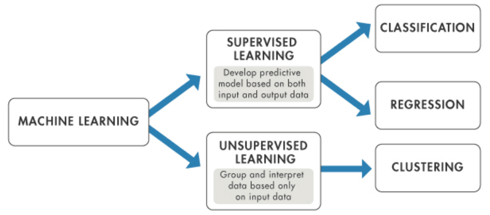

# Integridad Ecológica

El objetivo es estimar un índice de integridad ecológica (IIE) en México. La IE es la capacidad del ecosistema para mantener un sistema ecológico integrado, balanceado y adaptable, que tenga el rango completo de elementos y procesos que se esperarían en el área natural de la región.

Para modelar el IIE se utilizó la hemerobia como proxy, ésta representa el grado de transformación que mostró la vegetación primaria respecto a la cobertura terrestre actual, siendo una variable categórica ordinal, donde 0 es el estado intacto y 18 el de mayor degradación.

{width="1200"}

Teniendo un proxy de la variable que se quiere estimar y siendo éste una variable categórica, se puede ajustar un modelo supervisado de tipo clasificación.

{width="400"}

Hasta el momento, se han probado 2 modelos: red bayesiana y XGBoost.

## Red bayesiana

Es un modelo probabilístico gráfico, donde cada nodo corresponde a una variable aleatoria y cada arista representa la dependencia condicional entre las variables que conecta. El modelo tiene 4 capas:

-   Detección de signos: Observaciones obtenidas de sensores remotos.

-   Contextual: Representa las condiciones fisicoquímicas dentro de las cuales, las variables de la capa de detección de signos varían.

-   Latente: Define la condición de la integridad ecológica basándose en los valores de la capa de detección de signos y contextual.

-   Intervención humana: Condiciones provocadas por el ser humano, que podrían afectar la integridad ecológica.

Al tener una variable categórica como output, el modelo es de tipo clasificación, obteniendo la probabilidad de que cada pixel pertenezca a cada clase. Para asignar a qué clase pertenece cada pixel, por lo general, se toma la clase con mayor probabilidad.

|       |         |         |     |          |       |
|-------|---------|---------|-----|----------|-------|
| Pixel | Clase 0 | Clase 1 | ... | Clase 18 | Clase |
| 1     | 0.2     | 0.1     |     | 0.7      | 18    |
| ...   |         |         |     |          |       |
| n     | 0.01    | 0.6     |     | 0.2      | 1     |

Para convertir el resultado del modelo a un índice de 0 al 1, se estimó el promedio ponderado para cada pixel:

$\sum_{i}c_ip_i$

Con lo que se obtiene un número continuo del 0 al 18, posteriormente, se estandariza para obtener un número del 0 al 1, donde 1 es el estado intacto y 0 el de mayor degradación.

$\frac{18-\sum_{i}c_ip_i}{18}$

|                                         |           |       |       |
|-----------------------------------------|-----------|-------|-------|
|                                         | Precisión | Train | Test  |
| Original (red bayesiana con InFyS)      | 20.2%     |       |       |
| Red bayesiana                           | 48.0%     |       |       |
| XGBoost                                 | 75.1%     | 77.2% | 70.2% |
| XGBoost con slic con distancia al borde | 70.8%     | 73.8% | 63.7% |
| XGBoost con slic con distancia al borde |           |       |       |
